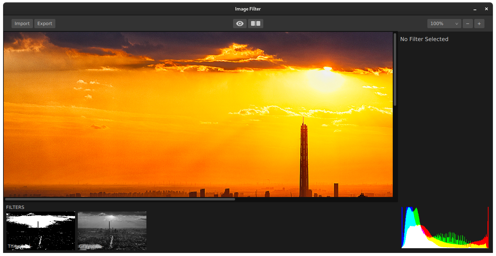

    
    <h1 align="center">Image Filter</h1>
    
Image filters with JavaFX UI

#### Development Setup

> git clone https://github.com/KaindlJulian/mms-image-filter.git

- JDK 14.0.1

- JavaFX 14.0.1 (from https://openjfx.io/)

* Add JavaFX to the project: https://www.jetbrains.com/help/idea/javafx.html#add-javafx-lib

* Set VM options: https://www.jetbrains.com/help/idea/javafx.html#vm-options

#### Adding new Filters

- Create new Class in the filters package implementing the `Filter` interface
- Add the Filter to the UI (`FilterBarManager` constructor)

#### UI

